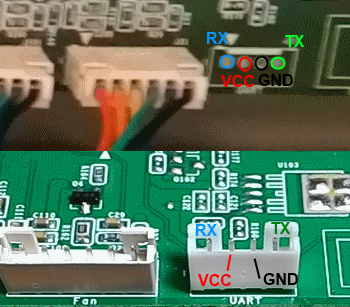

The board is a due based and has a serial port available on the backside of the board. The serial port is a 4 pin header 

| <!-- -->  | <!-- --> |
|-|-|
| Board pins voltage | 3.3v |
| Board firmware | Repetier for Davinci | 
| Board configuration note | Enable wifi in the firmware configuration file |
| ESP3D configuration note | Raw serial, no SD |