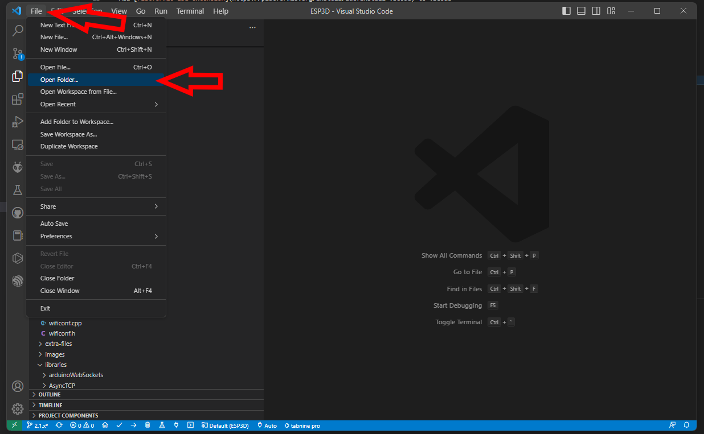

## Prepare the development environment

* Download and install [VSCode](https://code.visualstudio.com/download)

* Add [PlatformIO IDE extension](https://platformio.org/install/ide?install=vscode) to VSCode

!!! Note
    Platformio stopped support with espressif for esp32 since 3.0 core update, a community project [pioarduino](https://github.com/pioarduino/platform-espressif32) is now used for esp32 instead, the tests are done using arduino esp32 core 3.0.4 / IDF 5.1.4.

    `platform = https://github.com/pioarduino/platform-espressif32/releases/download/51.03.04/platform-espressif32.zip`

## Open the ESP3D directory folder in VSCode
The first time you open the project, vscode need to download all necessary files, so be patient

{ width="400" }

## ESP3D configuration   

Open esp3d/configuration.h and set features you want.

You can also generate it, using the ESP3D configurator, which simplify a lot this step.  



## Select the target in VSCode

{ width="400" }

* [env:esp32dev] for ESP32 boards   
* [env:esp32cam] for ESP32 Camera boards   
* [env:esp32-TTGO_T_Display] for ESP32 boards with TTGO_T display   
* [env:esp32-ST7789] for ESP32 boards with ST7789 display   
* [env:esp32-s2]for ESP32-S2 boards   
* [env:esp32-s3]for ESP32-S3 boards  
* [env:esp32-c3]for ESP32-C3 boards  
* [env:esp8266] for ESP8266 boards with 4MB flash    
* [env:esp01s_160mhz] for ESP8266 boards with 1MB flash   

## [Connect your board](/esp3d/v3.x/installation/#connect-your-board)

## Compile and flash your module

Use Upload and monitor from the target environment you selected to compile and flash your module.