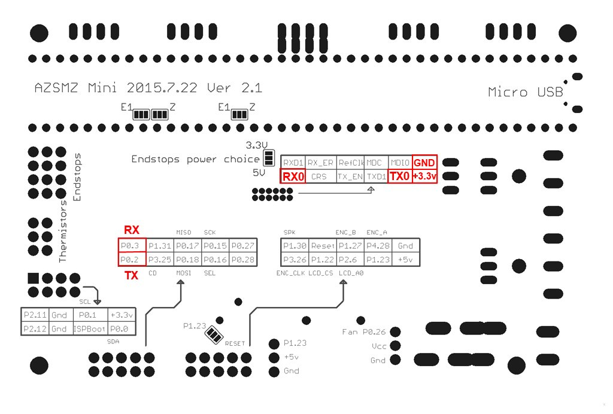

If you don't have the soldering skills to grab the connectors from the unpopulated ethernet connection, you can also get 3.3v and GND from the ISP header (bottom left on the diagram above).

| <!-- -->  | <!-- --> |
|-|-|
| Board pins voltage | 3.3v |
| Board firmware | Smoothieware | 
| Board configuration note | Enable second serial port in the config.txt |
| ESP3D configuration note | Raw serial, no SD |
