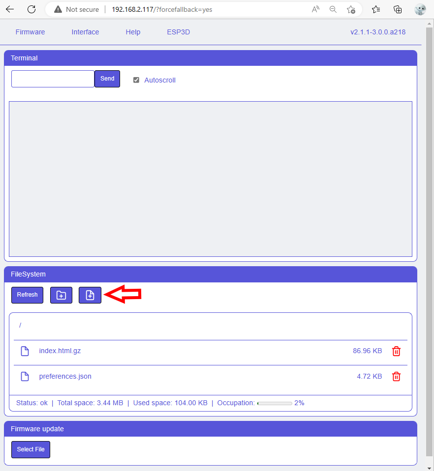
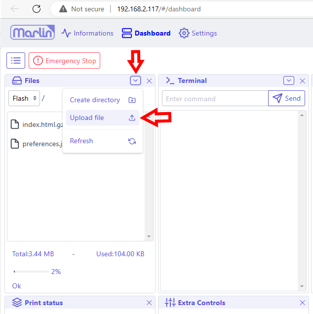
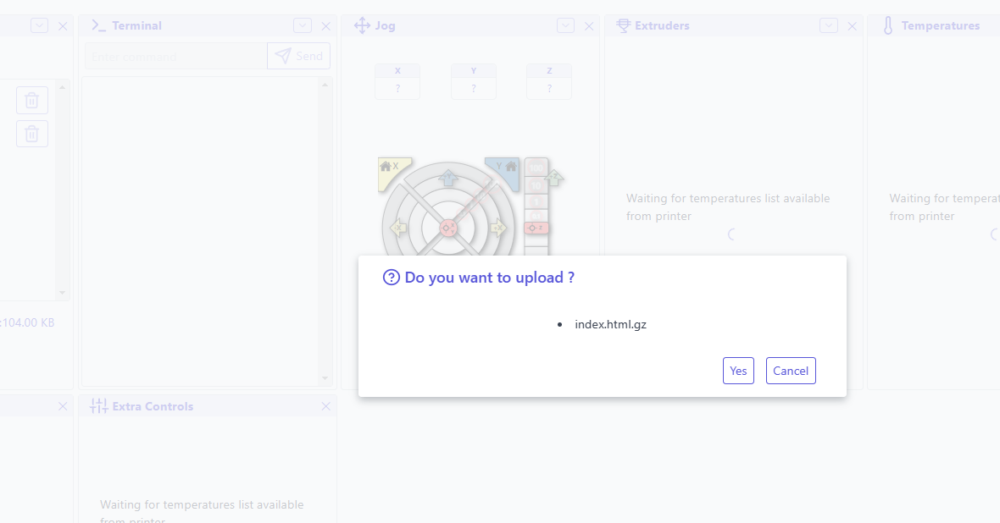
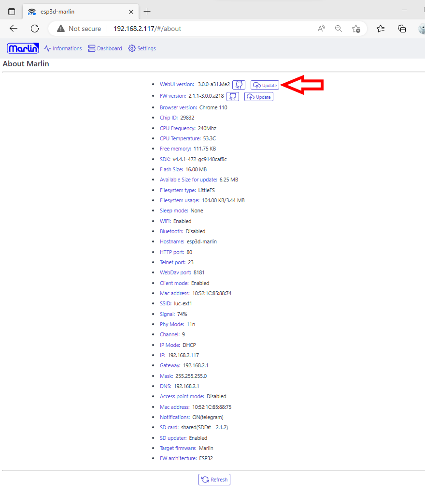

The Web UI is represented by one file : index.hml.gz   
The index.html.gz according targeted system is available [here](https://github.com/luc-github/ESP3D-WEBUI/tree/3.0/dist).   

Select the file according your system type (CNC/3D Printer/...) and system firmware (GRBL/Repetier...).   

The default language is english, additionnal language pack can be added later independantly.

### Upload index.html.gz

#### Using embedded uploader

If the embedded is not visible you can access to it using:
`http://your_IP_address?forcefallback=yes` anytime

#### Using Web UI
* You can upload file using Web UI file panel

* You can also directly update index.html.gz using Web UI update button

### Finalize update

Refresh the page to `http://your_IP` to display updated Web interface.

Note: you can also upload a customized `favicon.ico`
