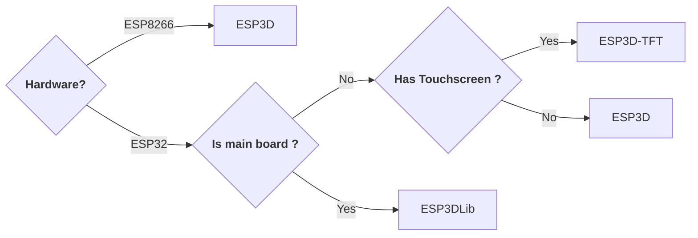
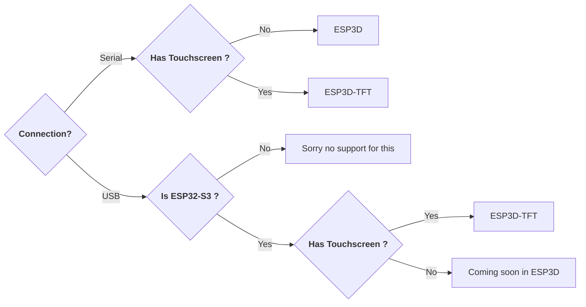
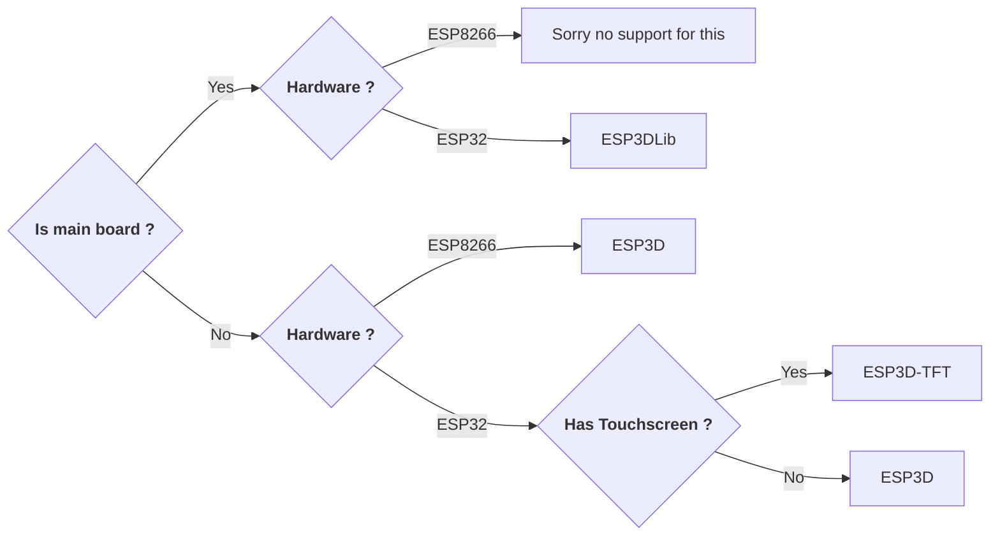

  
### What is ESP3D Ecosystem ?

ESP3D Ecosystem is a collection of projects based on espressif boards like esp8266 and esp32. The purpose is to provide WiFi feature to users of 3D printer, CNC, Sand Table and plotter.

Depending of the configuration and the hardware the solution will be different but the goal is to provide a set of feature equivalent accross devices.

Check on the menu the current projects, each one has a different implementation for same purpose. 

### What project to use ?

**Based on hardware**

**Based on connection**

**Based on feature**

